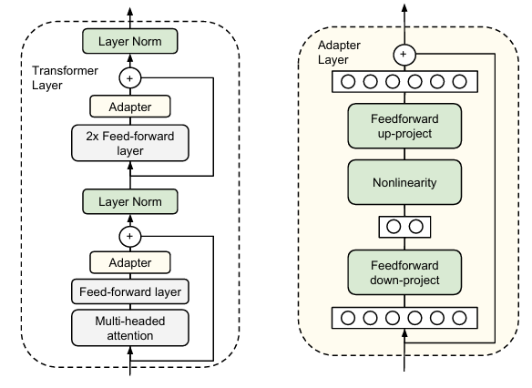

# Adapter-Tuning Transformer Models for Financial News Sentiment Analysis

The prewailing method of transferring pretrained large language model to particular domain is fine-tuning, however this is computationally expensive and less feasible as pretrained model gets increasingly larger. Adapter Tuning adds small task-specific modules to pre-trained model, freeze pre-trained model weights and only allow traninig on these additive adapter modules, which significantly reduced trainable parameters and provides a light-weight solution for knowledge transferring. 

[Low-Rank Adaptation, or LoRA](https://arxiv.org/abs/2106.09685), injects trainable rank decomposition matrices into each layer of transformer architecture. The lower rank controls the adapter trainable parameters and representation power, thus is flexible over various size of traning data set.

One big advantage of adapter is its moduality, one can train several adapters on different domains, and add/remove adapter layers as needed almost instaneously in live production environment at low cost of memory storage.

Another advantage is that adapter representational power can be adjusted through low rank value. If dataset is small, use smaller low rank; if dataset is medium, use larger low rank. If dataset is large, you may as well just fine tune the entire model. Especially when dataset is small, adapter tuning could have better performance than entire model fine-tuning.

## 1. Environment
- conda env create -f environment.yml
- pip install -r requirements.txt

## 2. Dataset
- `data`: host all data for this project \
[Financial Phrase Bank Dataset by Malo et al. (2014)](https://huggingface.co/datasets/takala/financial_phrasebank) is used in this project.

## 3. src folder
- `main.py`: for local machine running
- `main.ipynb`: for colab T4 GPU running. Code for mounting notebook to google drive is included.
- `dataload`: split all data  into train-val-test sets and loads in torch dataloader
- `tainer`: transformer training
- `lora`: lora adapter implementation

`bert-base-uncased` is used as the base BERT Model

## 4. Result Example
|                   | Fine-Tuning | LoRA Adapter Tuning | 
| :---:             | :---:   | :---:   |
| Training Time     | ~48 hours | ~7 min        |
| Trainable Params  | 109.5 mil | 295.6 thsnd   |
| % Total Params    | 100%      | 0.27%         | 
| CrossEntropyLoss  | 0.4748  | 0.3525  |
| Accuracy          | 0.8557  | 0.8514  |
| Recall            | 0.8562  | 0.8355  |
| Precision         | 0.8306  | 0.8508  |
| F1                | 0.8423  | 0.8509  |

